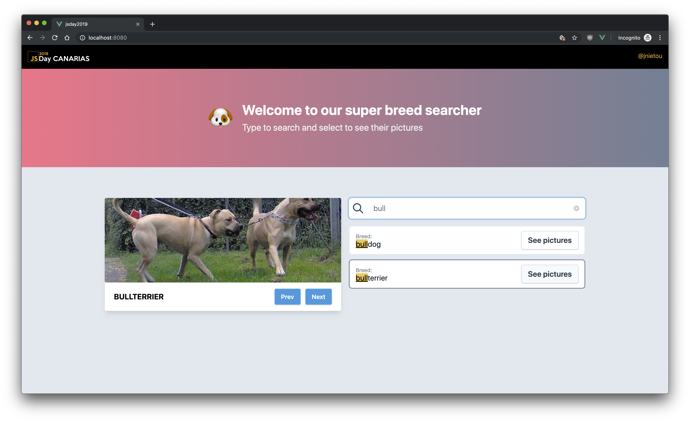

# CanariasJS Vue Workshop, What else? ☕️
>JS Day 08/11/2019

## Librerías que utilizaremos:
- [Vue.js](#)
- [Vue CLI](#)
- [Tailwind CSS](https://tailwindcss.com)
- [JSON server](https://github.com/typicode/json-server)

## ¿Qué vamos a hacer?

- Vamos a crear algunos componentes para componer un pequeño plugin que usaremos para nuestra UI.
- Con esa UI generaremos otro componente de autocompletado que consumirá datos desde nuestro servidor, utilizando un renderless component.

### Ahora en serio, ¿qué vamos a hacer?

Una pequeña aplicación que nos permitirá buscar razas de perros y que al seleccionar la raza, nos muestre imágenes de esa raza concreta. (Como internet siempre utiliza gatos, pues usaremos perros. Llamádme rebelde si queréis...😅)

### 📝 Cosas que veremos:

- [Slots, named slots y scoped slots.](https://vuejs.org/v2/guide/components-slots.html#Scoped-Slots-with-the-slot-scope-Attribute)
- Renderless components.
- UI personalizada como plugin.
- Tailwind CSS.
- Ideas para una mejor componentización.

### Resultado final:



## 🔌 ¿Qué debes tener previamente instalado?
- [GIT](https://git-scm.com/downloads)
- [Node](https://nodejs.org/es/download/)
- [VisualStudio Code](https://code.visualstudio.com/download)
- [Google Chrome](https://www.google.com/intl/es/chrome/)
- [Vue dev-tools](https://chrome.google.com/webstore/detail/vuejs-devtools/nhdogjmejiglipccpnnnanhbledajbpd?hl=es)

#### ⚠️ Extensiones recomendadas para Visual Studio Code

Para quer la experiencia de desarrollo sea la más óptima posible, es recomendable que instales las extensiones recomendadas para este proyecto. VSCode debería de sugerirte las extensiones que utilizaremos. De no ser así, podrás encontrarlas en el directorio `.vscode/` que se encuentra en raíz e instalarlas a mano.

#### 💻 Setup

- Para comenzar deberás clonar o hacer un fork de este repositorio.
- Para completar o saltar cada paso, iremos cambiando de branch a medida que vayamos completando las tareas. (`git checkout step-{siguiente paso}`)

**Iniciar la parte cliente**
```bash
## in /client

## Project setup
npm i
### Compiles and hot-reloads for development
npm run serve

### Compiles and minifies for production
npm run build

### Run your tests
npm run test

### Lints and fixes files
npm run lint

### Run your unit tests
npm run test:unit

### Customize configuration
See [Configuration Reference] (https://cli.vuejs.org/config/).
```

**Iniciar la parte servidor**
```bash
## in /server

## Project setup
npm i
### Starts the json-server
npm run start
```